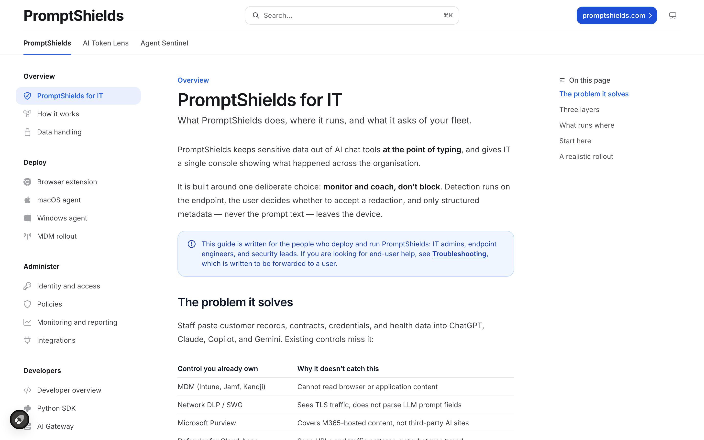
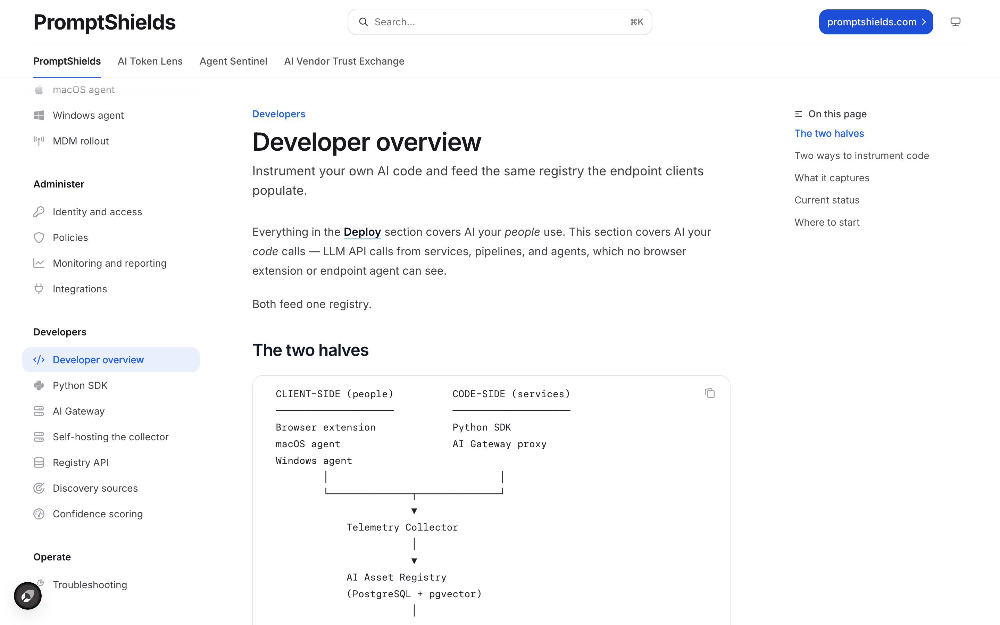

# Prompt Shields documentation

The source for [docs.promptshields.com](https://docs.promptshields.com), the deployment and administration guide for Prompt Shields.

## The problem

A security control that nobody can deploy correctly is not a control. Endpoint AI protection fails in predictable, documentable ways — permissions not granted at enrolment, a browser extension not force-installed so coverage depends on volunteers, an agent that silently stops reporting — and each of those failures presents as "we are covered" on a dashboard. This repository exists so that the deployment path, the data handling boundary, and the known failure modes are written down and reviewable before you commit a fleet to them.

## Quickstart

```bash
git clone https://github.com/Prompt-Shields/docs.git && cd docs
npx mint@latest dev
npx mint@latest broken-links
```

`dev` serves the site locally with live reload. `broken-links` must pass before publishing. Requires Node.js 18 or later; no other dependencies and no build step.

## How does it work?

**Mintlify is a documentation platform that renders MDX files into a hosted site using a JSON navigation manifest.** Pages are plain MDX; `docs.json` defines the site structure. There is no application code in this repository.



The three tabs at the top — PromptShields, AI Token Lens, Agent Sentinel — are separate products sharing one site. The left-hand groups follow the audience split described below.



```
  docs.json ................ site config and navigation tree
      |
      +-- introduction.mdx ....... what the product is, rollout sequence
      +-- how-it-works.mdx ....... detection and telemetry pipeline, end to end
      +-- data-handling.mdx ...... what is collected, what never leaves the device
      |
      +-- deploy/ ................ browser extension, macOS agent,
      |                            Windows agent, MDM rollout
      +-- admin/ ................. identity and access, policies,
      |                            monitoring and reporting, integrations
      +-- developers/ ............ Python SDK, AI gateway, self-host,
      |                            registry API, confidence scoring
      +-- troubleshooting.mdx .... cross-client failure modes
                |
                v
      commit to main --> automatic deploy --> docs.promptshields.com
```

The audience split is deliberate. `deploy/` and `admin/` are written for IT administrators, endpoint engineers, and security leads running a fleet. `developers/` is written for engineers instrumenting their own services. `troubleshooting.mdx` is written to be forwarded to an end user unedited.

### House rules for contributors

- **Never document prompt content flowing anywhere.** It does not, and the documentation must not imply otherwise.
- Mark unreleased integrations *Planned* or *In development*. Roadmap work is never described as shipped.
- Keep internal material — roadmap phases, customer names, pricing strategy, pull request numbers — out of this repository. It is public.

## What this does not do

- **This repository ships no product code.** Nothing here detects, redacts, or blocks anything. It is prose.
- **It is not a security specification.** The documentation describes intended behaviour of the clients. It is not a conformance statement, and it is not a substitute for reading the source of the client you are deploying.
- **It is not a compliance artefact.** Nothing in this repository constitutes an attestation, a certification, or evidence you can present to an auditor. Do not cite a documentation page as a control.
- **It does not describe every deployment.** Guidance assumes a managed fleet with a functioning MDM. Unmanaged or bring-your-own-device estates are out of scope and the coverage assumptions do not hold there.
- **Documentation drifts.** A page describing a client's behaviour reflects the release it was written against. Where the two disagree, the client is authoritative and the page is a bug.

## Free versus Prompt Shields Cloud

The documentation covers both sides of the boundary, and labels which is which. The boundary itself: **anything an individual engineer needs is free; anything an organisation or an auditor needs is paid.** No capability moves from the free side to the paid side.

| | Free — Apache 2.0, self-hosted | Prompt Shields Cloud |
|---|---|---|
| Detection and redaction | Complete, no feature gating | Same, plus managed detection models retrained continuously |
| Deployment | Self-hosted, single project, single user | Managed, multi-project, multi-tenant |
| Dashboard | Basic self-hosted views | Managed risk dashboard, OWASP LLM Top 10 and MITRE ATLAS mapping |
| Telemetry | OpenTelemetry-compatible emission you store yourself | Hosted retention, cross-project alerting and anomaly detection |
| Governance | None | Organisation-wide policy enforcement, policy versioning and approval workflows, SSO and SAML, SCIM, RBAC |
| Compliance evidence | None | Hash-chained tamper-evident audit logs, EU AI Act Article 12 exports, NIST AI RMF and OWASP mapping tables |
| Data controls | Entirely yours | Bring-your-own keys, region pinning, air-gapped deployment |
| Support | Community issues, best effort | Service level agreements, named support, data processing agreement and penetration test report handling |

This repository documents the free components in full. Cloud-only capabilities are marked as such on the page where they appear.

## Links

- Published site: [docs.promptshields.com](https://docs.promptshields.com)
- Product: [promptshields.com](https://promptshields.com)
- SDK and gateway source: [Prompt-Shields/prompt-shields-sdk](https://github.com/Prompt-Shields/prompt-shields-sdk)
- Security policy: report documentation issues that disclose a vulnerability privately to security@promptshields.com rather than opening a public issue. This repository has no `SECURITY.md`; the canonical policy is [prompt-shields-sdk/SECURITY.md](https://github.com/Prompt-Shields/prompt-shields-sdk/blob/main/SECURITY.md).
- Contributing: this repository has no `CONTRIBUTING.md`. Follow the house rules above and open a pull request against `main`.
